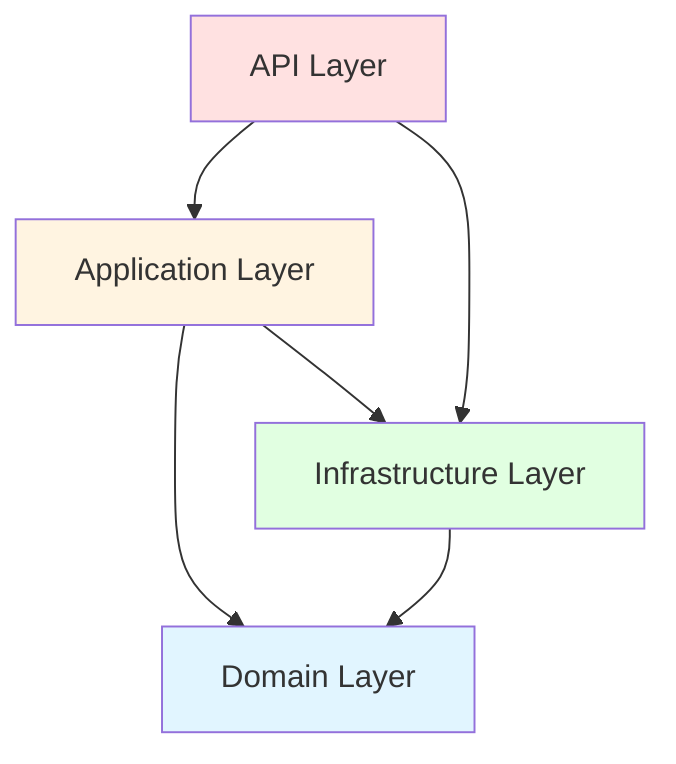
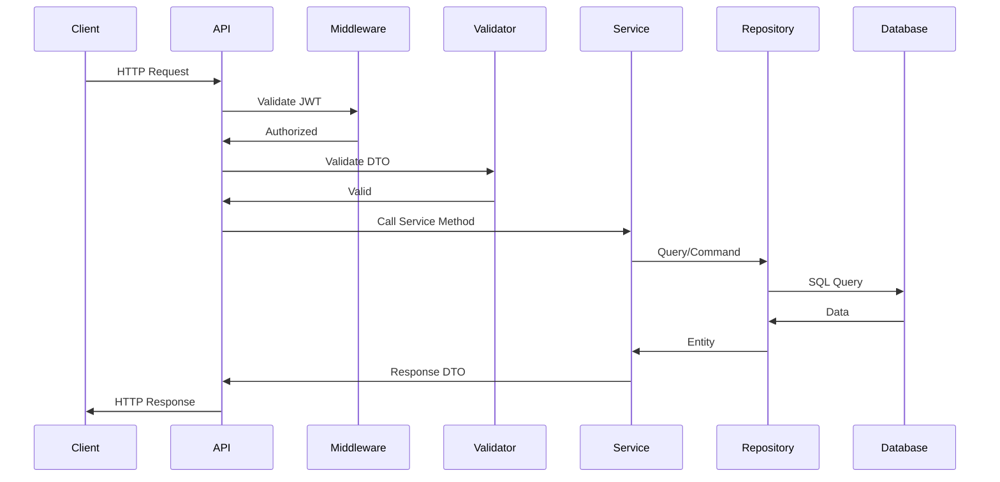
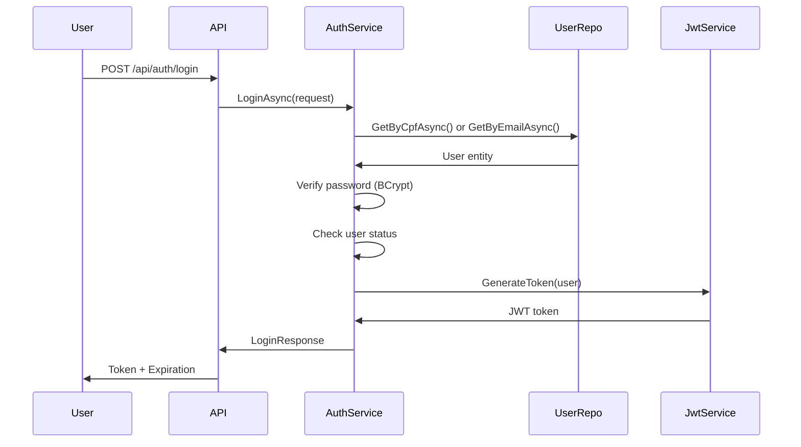
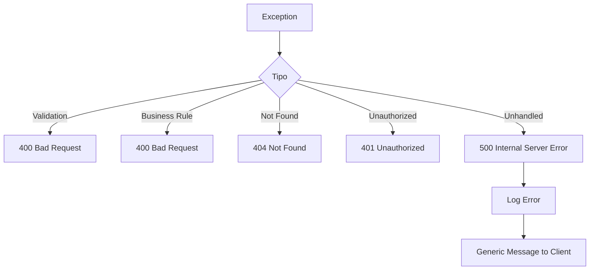

# Arquitetura do GFA Team Manager

## Visão Geral

O GFA Team Manager foi desenvolvido seguindo os princípios da **Clean Architecture** (também conhecida como Arquitetura Cebola ou Hexagonal), criada por Robert C. Martin. Esta abordagem garante:

- **Independência de frameworks**: A lógica de negócio não depende de frameworks específicos
- **Testabilidade**: Cada camada pode ser testada isoladamente
- **Independência de UI**: A interface pode ser alterada sem afetar a lógica
- **Independência de banco de dados**: A escolha do banco de dados é um detalhe de implementação
- **Regras de negócio isoladas**: As regras de negócio estão no centro e não conhecem detalhes externos

## Estrutura de Camadas



### 1. Domain Layer (Núcleo)

**Localização**: `src/GFATeamManager.Domain`

Esta é a camada mais interna e não possui dependências de outras camadas. Contém:

#### Entidades (`Entities/`)
- `BaseEntity.cs` - Classe base com propriedades comuns (Id, CreatedAt, UpdatedAt, IsDeleted)
- `User.cs` - Entidade de usuário com métodos de negócio
- `PreRegistration.cs` - Pré-cadastro de usuários
- `EmergencyContact.cs` - Contato de emergência
- `PasswordResetRequest.cs` - Solicitação de reset de senha

#### Enums (`Enums/`)
- `ProfileType.cs` - Tipos de perfil (Admin, Coach, Athlete, Staff)
- `UserStatus.cs` - Status do usuário (PendingRegistration, AwaitingActivation, Active, Rejected, Inactive)

#### Interfaces de Repositório (`Interfaces/Repositories/`)
- `IBaseRepository<T>` - Interface genérica com operações CRUD
- `IUserRepository` - Operações específicas de usuário
- `IPreRegistrationRepository` - Operações de pré-cadastro
- `IPasswordResetRequestRepository` - Operações de reset de senha

**Princípios**:
- Entidades contêm apenas lógica de negócio
- Métodos como `Activate()`, `Deactivate()`, `Reject()` encapsulam mudanças de estado
- Não há dependência de infraestrutura ou frameworks

### 2. Application Layer (Casos de Uso)

**Localização**: `src/GFATeamManager.Application`

Orquestra o fluxo de dados entre a camada de apresentação e o domínio. Contém:

#### Services (`Services/`)
- `AuthService.cs` - Lógica de autenticação e autorização
- `UserService.cs` - Gerenciamento de usuários
- `PreRegistrationService.cs` - Gerenciamento de pré-cadastros

#### DTOs (`DTOS/`)
Objetos de transferência de dados organizados por contexto:
- `Auth/` - LoginRequest, LoginResponse, ChangePasswordRequest, etc.
- `User/` - UserResponse, UpdateUserRequest, CompleteRegistrationRequest, etc.
- `PreRegistration/` - CreatePreRegistrationRequest, PreRegistrationResponse
- `Common/` - BaseResponse<T>, OperationResponse

#### Validators (`Validators/`)
Validação usando FluentValidation:
- `Auth/` - LoginRequestValidator, ChangePasswordRequestValidator
- `User/` - CompleteRegistrationRequestValidator, UpdateUserRequestValidator
- `PreRegistration/` - CreatePreRegistrationRequestValidator

#### Settings (`Settings/`)
- `JwtSettings.cs` - Configurações JWT

**Princípios**:
- Services coordenam operações entre repositórios e domínio
- DTOs evitam expor entidades diretamente
- Validadores garantem dados consistentes
- Retorna `BaseResponse<T>` ou `OperationResponse` para comunicação padronizada

### 3. Infrastructure Layer (Detalhes de Implementação)

**Localização**: `src/GFATeamManager.Infrastructure`

Implementa as interfaces definidas no domínio e fornece acesso a recursos externos:

#### Data Context (`Data/Context/`)
- `AppDbContext.cs` - DbContext do Entity Framework Core
- Configuração de entidades
- Soft delete com query filters

#### Configurações de Entidades (`Data/Configuration/`)
- `UserConfiguration.cs` - Mapeamento e constraints da tabela Users
- `PreRegistrationConfiguration.cs` - Configuração de PreRegistrations
- Etc.

#### Repositórios (`Data/Repositories/`)
- `BaseRepository<T>` - Implementação genérica com operações CRUD
- `UserRepository` - Implementação específica de IUserRepository
- `PreRegistrationRepository` - Implementação de IPreRegistrationRepository
- `PasswordResetRequestRepository` - Implementação de reset de senha

#### Migrations (`Migrations/`)
- Versionamento do esquema do banco de dados
- Migrations do Entity Framework Core

#### Identity (`Identity/`)
- `JwtService.cs` - Geração e validação de tokens JWT

#### Seed Data (`Data/Seed/`)
- `SeedData.cs` - Dados iniciais (usuário admin padrão)

**Princípios**:
- Implementa interfaces do domínio
- Detalhes de persistência isolados
- Configurações de banco centralizadas

### 4. API Layer (Apresentação)

**Localização**: `src/GFATeamManager.Api`

Camada de entrada da aplicação, expondo endpoints REST:

#### Endpoints (`Endpoints/`)
Usando Minimal API do .NET:
- `AuthEndpoints.cs` - /api/auth/* (login, change-password, request-password-reset)
- `UserEndpoints.cs` - /api/users/* (CRUD, activate, deactivate)
- `PreRegistrationEndpoints.cs` - /api/pre-registration/*

#### Extensions (`Extensions/`)
Configurações modulares:
- `DependencyInjectionExtensions.cs` - Registro de serviços
- `DatabaseExtensions.cs` - Configuração do EF Core
- `JwtExtensions.cs` - Configuração JWT
- `SwaggerExtensions.cs` - Configuração Swagger
- `CorsExtensions.cs` - Configuração CORS
- `RateLimitExtensions.cs` - Rate limiting
- `ValidationExtensions.cs` - Integração FluentValidation

#### Middlewares (`Middlewares/`)
- `GlobalExceptionMiddleware.cs` - Tratamento global de erros

#### Program.cs
- Configuração da aplicação
- Pipeline de middlewares
- Mapeamento de endpoints

**Princípios**:
- Endpoints finos, delegam para services
- Validação automática via FluentValidation
- Respostas padronizadas
- Documentação automática com Swagger

## Fluxo de Dados



## Padrões de Design Utilizados

### 1. Repository Pattern
Abstrai a lógica de acesso a dados, permitindo trocar implementações sem afetar a aplicação.

```csharp
public interface IUserRepository : IBaseRepository<User>
{
    Task<User?> GetByCpfAsync(string cpf);
    Task<User?> GetByEmailAsync(string email);
    Task<List<User>> GetByStatusAsync(UserStatus status);
}
```

### 2. Dependency Injection
Todas as dependências são injetadas via construtor, facilitando testes e desacoplamento.

```csharp
public class UserService : IUserService
{
    private readonly IUserRepository _userRepository;
    private readonly IPreRegistrationRepository _preRegistrationRepository;
    
    public UserService(
        IUserRepository userRepository,
        IPreRegistrationRepository preRegistrationRepository)
    {
        _userRepository = userRepository;
        _preRegistrationRepository = preRegistrationRepository;
    }
}
```

### 3. Unit of Work (implícito via DbContext)
Entity Framework Core atua como Unit of Work, gerenciando transações e rastreando mudanças.

### 4. DTO Pattern
Transferência de dados entre camadas usando objetos dedicados, nunca expondo entidades diretamente.

```csharp
public class UserResponse
{
    public Guid Id { get; set; }
    public string FullName { get; set; }
    public string Email { get; set; }
    // ... outros campos
}
```

### 5. Strategy Pattern (Validação)
FluentValidation permite diferentes estratégias de validação por tipo de request.

### 6. Factory Pattern (Response)
BaseResponse<T> e OperationResponse usam factory methods:

```csharp
return BaseResponse<UserResponse>.Success(data);
return BaseResponse<UserResponse>.Failure("Erro");
```

## Fluxo de Autenticação



## Estratégia de Validação

1. **Validação de DTO**: FluentValidation valida requests antes de chegarem aos services
2. **Validação de Negócio**: Services validam regras de negócio
3. **Validação de Domínio**: Entidades validam invariantes
4. **Validação de Dados**: EF Core garante constraints do banco

## Tratamento de Erros



## Soft Delete Strategy

Todas as entidades herdam de `BaseEntity` com propriedade `IsDeleted`:

```csharp
public abstract class BaseEntity
{
    public Guid Id { get; set; }
    public DateTime CreatedAt { get; set; }
    public DateTime UpdatedAt { get; set; }
    public bool IsDeleted { get; set; }
}
```

Query filters no DbContext garantem que registros deletados não apareçam em queries:

```csharp
modelBuilder.Entity<User>().HasQueryFilter(x => !x.IsDeleted);
```

## Segurança

### Hashing de Senhas
- **BCrypt.NET** com salt automático
- Custo de trabalho apropriado para segurança vs performance

### JWT
- Tokens assinados com chave secreta
- Validade de 8 horas
- Claims incluem: UserId, CPF, Email, Profile

### Rate Limiting
- Limitação de requisições por IP
- Proteção contra ataques de força bruta

### CORS
- Origens permitidas configuráveis
- Proteção contra requisições cross-origin não autorizadas

## Testes

A arquitetura facilita testes em cada camada:

- **Domain Tests**: Testes unitários de entidades e lógica de negócio
- **Application Tests**: Testes unitários de services com mocks
- **Infrastructure Tests**: Testes de integração com banco de dados
- **API Tests**: Testes de integração end-to-end

## Escalabilidade

Para suportar até 120 usuários:
- Arquitetura simples e eficiente
- Queries otimizadas com EF Core
- Indexes no banco de dados
- Rate limiting para proteção
- Possibilidade futura de cache (Redis)

## Migração e Versionamento

- **Entity Framework Migrations** para versionamento do schema
- Migrations executadas automaticamente no startup
- Seed data para configuração inicial

## Próximos Passos

- Implementação do frontend Next.js PWA
- Sistema de gerenciamento de atividades
- Notificações push para PWA
- Relatórios e dashboards
- Sistema de cache para melhor performance
