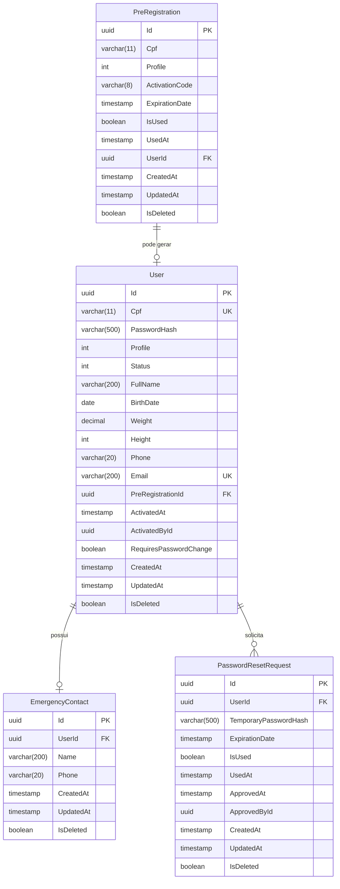

# Documentação do Banco de Dados

## Visão Geral

O GFA Team Manager utiliza **PostgreSQL 16** como sistema de gerenciamento de banco de dados. O schema foi projetado seguindo os princípios de normalização e integridade referencial.

## Diagrama Entidade-Relacionamento



## Tabelas

### Users

Armazena informações dos usuários do sistema (administradores, coaches, atletas e staff).

| Coluna | Tipo | Constraints | Descrição |
|--------|------|-------------|-----------|
| Id | UUID | PK | Identificador único |
| Cpf | VARCHAR(11) | NOT NULL, UNIQUE | CPF do usuário (apenas números) |
| PasswordHash | VARCHAR(500) | NOT NULL | Senha hasheada com BCrypt |
| Profile | INT | NOT NULL | Tipo de perfil (1=Admin, 2=Coach, 3=Athlete, 4=Staff) |
| Status | INT | NOT NULL | Status do usuário (1=PendingRegistration, 2=AwaitingActivation, 3=Active, 4=Rejected, 5=Inactive) |
| FullName | VARCHAR(200) | NOT NULL | Nome completo |
| BirthDate | DATE | NOT NULL | Data de nascimento |
| Weight | DECIMAL(5,2) | NOT NULL | Peso em kg |
| Height | INT | NOT NULL | Altura em cm |
| Phone | VARCHAR(20) | NOT NULL | Telefone |
| Email | VARCHAR(200) | NOT NULL, UNIQUE | Email |
| PreRegistrationId | UUID | FK, NOT NULL | Referência ao pré-cadastro |
| ActivatedAt | TIMESTAMP | NULL | Data/hora de ativação |
| ActivatedById | UUID | NULL | ID do admin que ativou |
| RequiresPasswordChange | BOOLEAN | NOT NULL, DEFAULT FALSE | Indica se deve trocar senha |
| CreatedAt | TIMESTAMP | NOT NULL | Data/hora de criação |
| UpdatedAt | TIMESTAMP | NOT NULL | Data/hora da última atualização |
| IsDeleted | BOOLEAN | NOT NULL, DEFAULT FALSE | Soft delete flag |

**Índices**:
- PRIMARY KEY (Id)
- UNIQUE INDEX (Cpf)
- UNIQUE INDEX (Email)

**Relacionamentos**:
- `PreRegistrationId` → PreRegistrations.Id (RESTRICT)
- `EmergencyContact` → 1:1 (CASCADE)
- `PasswordResetRequests` → 1:N

### PreRegistrations

Armazena códigos de ativação gerados por administradores para permitir o cadastro de novos usuários.

| Coluna | Tipo | Constraints | Descrição |
|--------|------|-------------|-----------|
| Id | UUID | PK | Identificador único |
| Cpf | VARCHAR(11) | NOT NULL | CPF do futuro usuário |
| Profile | INT | NOT NULL | Perfil que será atribuído |
| ActivationCode | VARCHAR(8) | NOT NULL | Código de ativação gerado |
| ExpirationDate | TIMESTAMP | NOT NULL | Data/hora de expiração (7 dias) |
| IsUsed | BOOLEAN | NOT NULL, DEFAULT FALSE | Se o código já foi usado |
| UsedAt | TIMESTAMP | NULL | Data/hora de utilização |
| UserId | UUID | FK, NULL | Usuário que utilizou o código |
| CreatedAt | TIMESTAMP | NOT NULL | Data/hora de criação |
| UpdatedAt | TIMESTAMP | NOT NULL | Data/hora da última atualização |
| IsDeleted | BOOLEAN | NOT NULL, DEFAULT FALSE | Soft delete flag |

**Índices**:
- PRIMARY KEY (Id)
- INDEX (Cpf)

**Relacionamentos**:
- `UserId` → Users.Id (opcional, preenchido quando usado)

**Regras de Negócio**:
- Código de ativação tem 8 caracteres alfanuméricos
- Expira em 7 dias após criação
- Pode ser regenerado se não foi usado

### EmergencyContacts

Contatos de emergência dos usuários.

| Coluna | Tipo | Constraints | Descrição |
|--------|------|-------------|-----------|
| Id | UUID | PK | Identificador único |
| UserId | UUID | FK, NOT NULL | Referência ao usuário |
| Name | VARCHAR(200) | NOT NULL | Nome do contato |
| Phone | VARCHAR(20) | NOT NULL | Telefone do contato |
| CreatedAt | TIMESTAMP | NOT NULL | Data/hora de criação |
| UpdatedAt | TIMESTAMP | NOT NULL | Data/hora da última atualização |
| IsDeleted | BOOLEAN | NOT NULL, DEFAULT FALSE | Soft delete flag |

**Índices**:
- PRIMARY KEY (Id)
- UNIQUE INDEX (UserId)

**Relacionamentos**:
- `UserId` → Users.Id (CASCADE)

**Regras de Negócio**:
- Cada usuário possui exatamente um contato de emergência
- Relacionamento 1:1 com User

### PasswordResetRequests

Solicitações de reset de senha dos usuários.

| Coluna | Tipo | Constraints | Descrição |
|--------|------|-------------|-----------|
| Id | UUID | PK | Identificador único |
| UserId | UUID | FK, NOT NULL | Usuário solicitante |
| TemporaryPasswordHash | VARCHAR(500) | NULL | Hash da senha temporária gerada |
| ExpirationDate | TIMESTAMP | NULL | Data/hora de expiração da senha temporária |
| IsUsed | BOOLEAN | NOT NULL, DEFAULT FALSE | Se a senha temporária foi usada |
| UsedAt | TIMESTAMP | NULL | Data/hora de utilização |
| ApprovedAt | TIMESTAMP | NULL | Data/hora de aprovação pelo admin |
| ApprovedById | UUID | NULL | ID do admin que aprovou |
| CreatedAt | TIMESTAMP | NOT NULL | Data/hora de criação |
| UpdatedAt | TIMESTAMP | NOT NULL | Data/hora da última atualização |
| IsDeleted | BOOLEAN | NOT NULL, DEFAULT FALSE | Soft delete flag |

**Índices**:
- PRIMARY KEY (Id)
- INDEX (UserId)

**Relacionamentos**:
- `UserId` → Users.Id

**Regras de Negócio**:
- Usuário só pode ter uma solicitação pendente por vez
- Após aprovação, senha temporária é gerada e expira em 24 horas
- Senha temporária pode ser usada para login e deve ser trocada

## Enums

### ProfileType

Tipos de perfil de usuário:

| Valor | Nome | Descrição |
|-------|------|-----------|
| 1 | Admin | Administrador do sistema |
| 2 | Coach | Treinador/Coach |
| 3 | Athlete | Atleta |
| 4 | Staff | Equipe de apoio |

### UserStatus

Status do usuário:

| Valor | Nome | Descrição |
|-------|------|-----------|
| 1 | PendingRegistration | Aguardando completar cadastro |
| 2 | AwaitingActivation | Cadastro completo, aguardando aprovação |
| 3 | Active | Usuário ativo no sistema |
| 4 | Rejected | Cadastro rejeitado por admin |
| 5 | Inactive | Usuário desativado |

## Queries Comuns

### Buscar usuários aguardando ativação

```sql
SELECT u.Id, u.FullName, u.Email, u.Profile, u.CreatedAt
FROM Users u
WHERE u.Status = 2 -- AwaitingActivation
  AND u.IsDeleted = false
ORDER BY u.CreatedAt ASC;
```

### Buscar pré-cadastros válidos por CPF

```sql
SELECT p.Id, p.Cpf, p.ActivationCode, p.ExpirationDate, p.Profile
FROM PreRegistrations p
WHERE p.Cpf = '12345678901'
  AND p.IsUsed = false
  AND p.ExpirationDate > NOW()
  AND p.IsDeleted = false;
```

### Buscar solicitações de reset pendentes

```sql
SELECT pr.Id, u.FullName, u.Email, pr.CreatedAt
FROM PasswordResetRequests pr
INNER JOIN Users u ON pr.UserId = u.Id
WHERE pr.ApprovedAt IS NULL
  AND pr.IsDeleted = false
ORDER BY pr.CreatedAt ASC;
```

### Buscar usuários ativos com contato de emergência

```sql
SELECT 
    u.Id,
    u.FullName,
    u.Email,
    u.Phone,
    u.Profile,
    ec.Name AS EmergencyContactName,
    ec.Phone AS EmergencyContactPhone
FROM Users u
LEFT JOIN EmergencyContacts ec ON u.Id = ec.UserId
WHERE u.Status = 3 -- Active
  AND u.IsDeleted = false
ORDER BY u.FullName;
```

## Estratégia de Soft Delete

Todas as tabelas implementam soft delete através da coluna `IsDeleted`:

- **Vantagens**:
  - Preserva histórico
  - Permite auditoria
  - Possibilita recuperação
  - Mantém integridade referencial

- **Implementação**:
  - Entity Framework configura query filters automáticos
  - Queries normais não retornam registros deletados
  - Possível acessar deletados com `IgnoreQueryFilters()`

## Migrations

As migrations são gerenciadas pelo Entity Framework Core:

```bash
# Criar nova migration
dotnet ef migrations add MigrationName --project src/GFATeamManager.Infrastructure --startup-project src/GFATeamManager.Api

# Aplicar migrations
dotnet ef database update --project src/GFATeamManager.Infrastructure --startup-project src/GFATeamManager.Api

# Reverter migration
dotnet ef database update PreviousMigrationName --project src/GFATeamManager.Infrastructure --startup-project src/GFATeamManager.Api
```

## Seed Data

O sistema inicializa com dados padrão:

**Usuário Admin**:
- CPF: 12345678901
- Email: admin@gfateammanager.com
- Senha: Admin@123
- Profile: Admin
- Status: Active

## Performance e Otimização

### Índices

Índices criados para otimização:
- **Users.Cpf** (UNIQUE): Busca rápida por CPF
- **Users.Email** (UNIQUE): Busca rápida por email e validação de unicidade
- **PreRegistrations.Cpf**: Busca de pré-cadastros por CPF
- **PasswordResetRequests.UserId**: Busca de solicitações por usuário

### Considerações

Para até 120 usuários:
- Schema atual é suficiente
- Índices garantem performance adequada
- Sem necessidade de particionamento
- Queries simples e eficientes

## Backup e Recuperação

Recomendações:

```bash
# Backup
pg_dump -U postgres -d gfateammanager > backup.sql

# Restore
psql -U postgres -d gfateammanager < backup.sql
```

## Segurança

- Senhas armazenadas com BCrypt (custo apropriado)
- Constraints de unique evitam duplicação
- Foreign keys garantem integridade referencial
- Soft delete preserva dados históricos
- Nenhuma senha em texto plano

## Evolução Futura

Possíveis adições:
- Tabela de Activities (treinos, jogos, reuniões)
- Tabela de ActivityParticipations (presença)
- Tabela de Notifications
- Tabela de Documents/Files
- Audit log table

## Conexão

String de conexão (Development):
```
Host=localhost;Port=5432;Database=gfateammanager;Username=postgres;Password=Dev@123456
```

Para produção, use variáveis de ambiente e secrets management.
